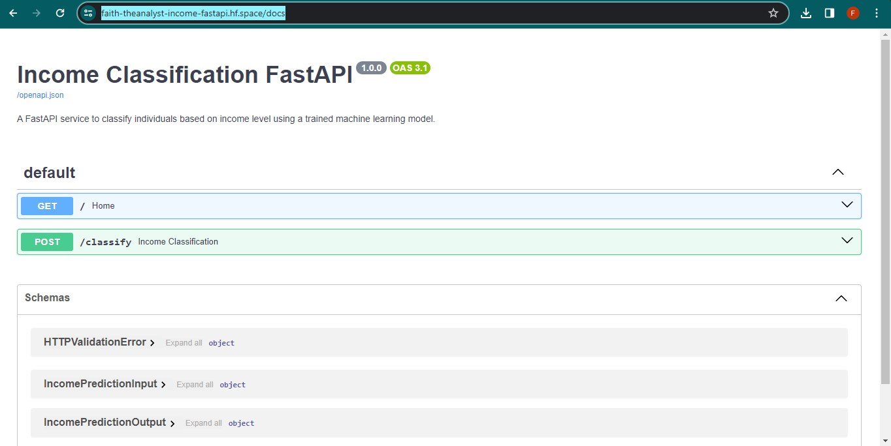
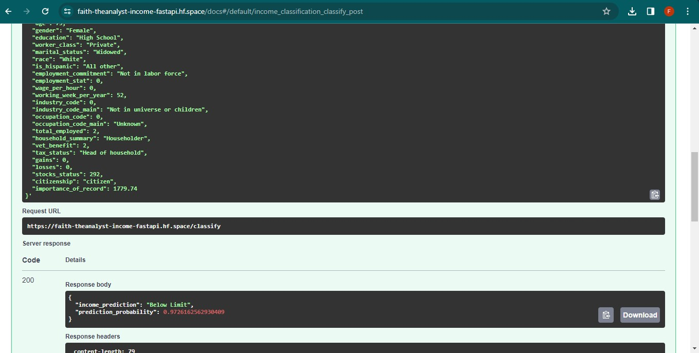

# Income-Prediction-ML-Project
This repository contains a machine learning project focused on predicting income levels and deploying the model into an app frontend using Streamlit and a web application backend using FastAPI.

<p align="center">
  
</p>

This project aims to leverage machine learning to predict income levels, addressing the challenges of income inequality and providing insights for policymakers.

## Summary
| Jupyter Notebook | Power BI Dashboard | Published Article | Deployed App on Hugging Face | Deployed FastAPI on Hugging Face |
| ----------------- | ------------------ | ------------------ | ---------------------------- | --------------------------------- |
|[Notebook with analysis and model development](https://github.com/Faith-theAnalyst/Capstone_Project_Income_Prediction_Challenge/blob/main/Code/income.ipynb)|   |[Link to Deployed Streamlit App](https://huggingface.co/spaces/Faith-theAnalyst/income_prediction_Streamlit_App)| |[Link to Deployed FastAPI](https://faith-theanalyst-income-fastapi.hf.space/docs)|

## FastAPI Interface
After clicking on the link to the working FastAPI, click on "Try It Out", provide the required details, and click on the **"EXECUTE"** button.




### After Prediction


# Repository Contents:
- [Project Overview](#project-overview)
- [Project Setup](#project-setup)
- [Data Fields](#data-fields)
- [Business Understanding](#business-understanding)
- [Data Understanding](#data-understanding)
- [Data Preparation](#data-preparation)
- [Modeling](#modeling)
- [Evaluation](#evaluation)
- [Deployment](#deployment)
- [Author](#author)


# Project Overview:
**i. Data Collection and Preprocessing:** I loaded and preprocessed a comprehensive dataset containing income-related data to train and evaluate the income prediction model.

**ii. Machine Learning Model:** I implemented a machine learning model tailored for predicting income levels. This model has been fine-tuned to achieve high accuracy in predicting income thresholds.

**iii. FAST API Integration:** I've seamlessly integrated the trained machine learning model into a web application using FAST API. This web application allows users to input individual data and receive instant predictions regarding income levels.

**iv. Usage and Deployment:** In this README file, you will find detailed instructions on how to use and deploy this web application, making it user-friendly for both developers and policymakers.

# Project Setup:
To set up the project environment, follow these steps:

i. Clone the repository:

```bash 
git clone https://github.com/your_username/Income-Prediction-ML-Project-with-FastAPI-Deployment.git
```

ii. Create a virtual environment and install the required dependencies:

- **Windows:**
  ```bash
  python -m venv venv; venv\Scripts\activate; python -m pip install -q --upgrade pip; python -m pip install -qr requirements.txt
  ```

- **Linux & MacOS:**
  ```bash
  python3 -m venv venv; source venv/bin/activate; python -m pip install -q --upgrade pip; python -m pip install -qr requirements.txt  
  ```

## Data Fields
The data used in this project consists of a diverse collection of income-related attributes obtained from [source](your_data_source_link).

| Column Name                | Data Type   | Description                                      |
|----------------------------|-------------|--------------------------------------------------|
| Age                        | Numeric     | Age of the individual                            |
| Gender                     | Categorical | Gender of the individual                        |
| Education                  | Categorical | Education level of the individual               |
| Class Of Worker            | Categorical | Class of worker                                 |
| Education Institute        | Categorical | Enrollment status in an educational institution in the last week  |
| Marital Status             | Categorical | Marital status                                  |
| Race                       | Categorical | Race                                            |
| Hispanic Origin            | Categorical | Hispanic origin                                 |
| Employment Commitment      | Categorical | Full or part-time employment status             |
| Unemployment Reason        | Categorical | Reason for unemployment                         |
| Employment Stat            | Categorical | Owns a business or is self-employed             |

